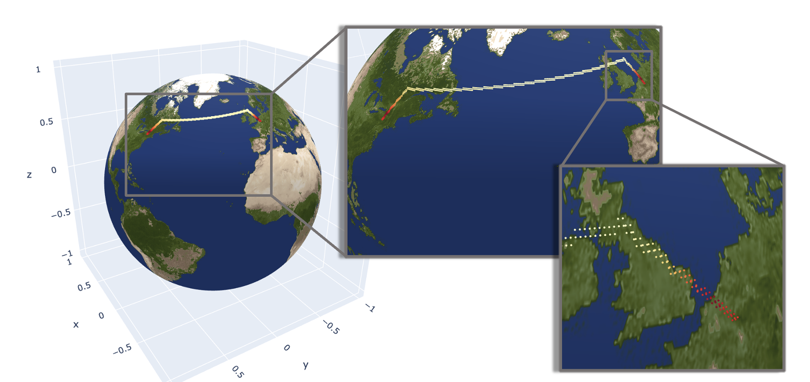

# Welcome to Polytope's documentation!

Polytope is a feature extraction software developed by ECMWF. 
It uses concepts of computational geometry to extract n-dimensional polygons (also known as *polytopes*) from datacubes. 

In particular, it can be used to request:

- 2D cut-outs, such as country cut-outs, from a datacube
    

    

        
    

    

- timeseries from a datacube
    

    

        
    

    

- more complicated spatio-temporal paths, such as flight paths, from a datacube
    

    

        
    

    

- and many more high-dimensional shapes in arbitrary dimensions...

<!-- 

Note that Polytope reads only the user-requested data, instead of whole fields. Importantly, this implies a significant decrease of the I/O usage when reading data from a datacube.

 -->

!!! important
    Note that Polytope reads only the user-requested data, instead of whole fields. Importantly, this implies a significant decrease of the I/O usage when reading data from a datacube.

See <a href="./Overview/Overview">Overview</a> for more information.

To learn more about how to use Polytope, refer to the <a href="./User_Guide/Overview">User Guide</a>. In particular, see the Quickstart page for a step-by-step example of how to use the Polytope software.
For a more in-depth explanation of how Polytope achieves its feature exctraction, refer to the <a href="./Developer_Guide/Overview">Developer Guide</a>.

# License

*Polytope* is available under the open source [Apache License](http://www.apache.org/licenses/LICENSE-2.0).
 In applying this licence, ECMWF does not waive the privileges and immunities granted to it by virtue of its status as an intergovernmental organisation nor does it submit to any jurisdiction.

