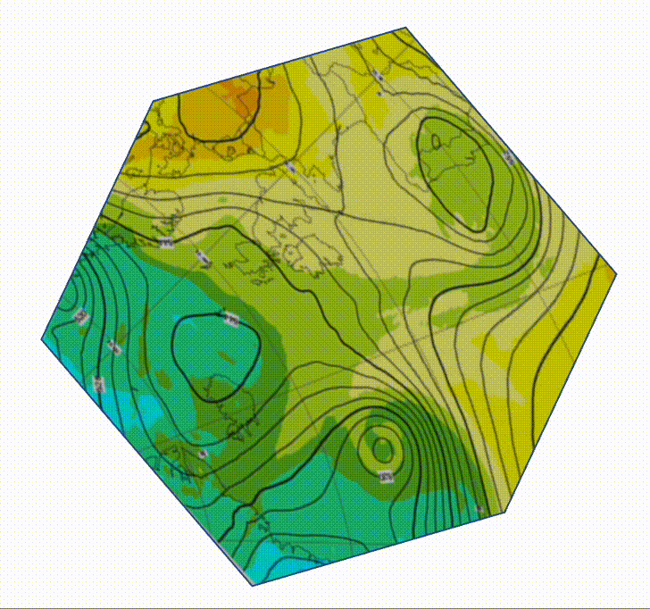
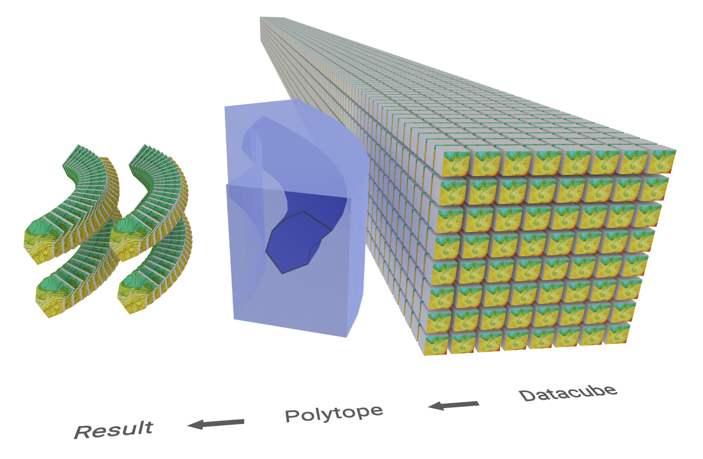
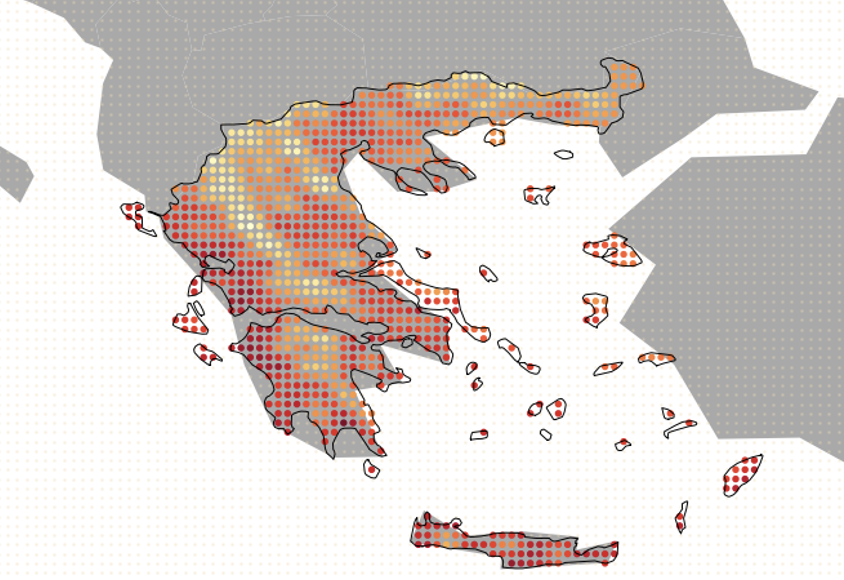
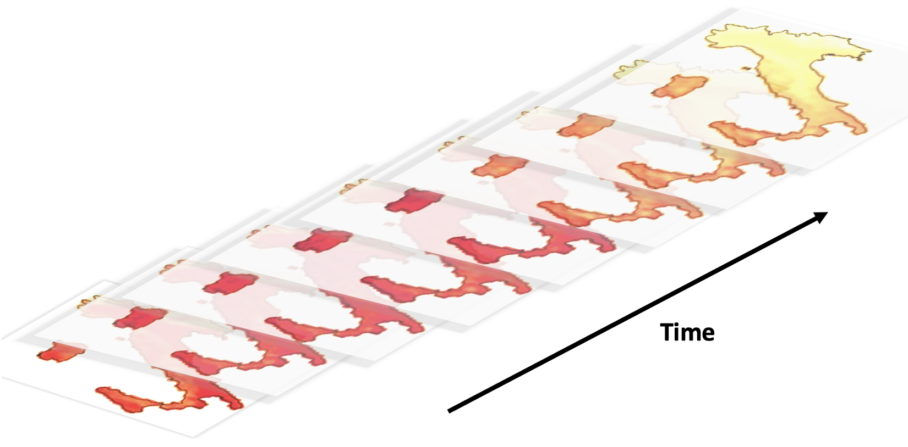
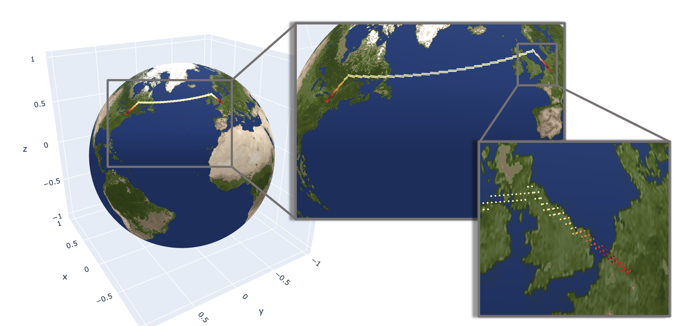

<!-- <h2 align="center" margin=0px> -->
<!-- 
 -->
<!-- 

<!--    -->
<!-- 

<h3 align="center">
<!-- <h2> -->
<!--  
 
 
Feature Extraction
  for Datacubes
</h3>

  --> 

<!--    -->
<!--  -->

<h3 align="center">
<!-- <h2> -->

  
Feature Extraction for Datacubes
</h3>
<!-- 

 -->

<!--   -->
<!--   -->
<!--   -->
<!-- 

  <h5>Feature Extraction for Datacubes</h5>
  

  

 -->

<!--  -->
<!-- 

 -->

   
  
  
  
  

  <a href="#concept">Concept</a> •
  <a href="#installation">Installation</a> •
  <a href="#example">Example</a> •
  <a href="#testing">Testing</a> •
  <a href="https://polytope.readthedocs.io/en/latest/">Documentation</a>

Polytope is a library for extracting complex data from datacubes. It provides an API for non-orthogonal access to data, where the stencil used to extract data from the datacube can be any arbitrary n-dimensional polygon (called a *polytope*). This can be used to efficiently extract complex features from a datacube, such as polygon regions or spatio-temporal paths.

Polytope is designed to extend different datacube backends.
* Xarray dataarrays
* FDB object stores (coming soon)

Polytope supports datacubes which have branching, non-uniform indexing, and even cyclic axes. If the datacube backend supports byte-addressability and efficient random access (either in-memory or direct from storage), *polytope* can be used to dramatically decrease overall I/O load.

| :warning: This project is BETA and will be experimental for the foreseeable future. Interfaces and functionality are likely to change. DO NOT use this software in any project/software that is operational. |
|--------------------------------------------------------------------------------------------------------------------------------------------------------------------------------------------------------------|

## Concept 

The broad concept behind the Polytope algorithm is summarised in the figure below. 
    <!-- 
 -->
    

        
    

    <!-- 
 -->

The Polytope algorithm can for example be used to extract:

- 2D cut-outs, such as country cut-outs, from a datacube
    <!-- 
 -->
    

        
    

    <!-- 
 -->

- timeseries from a datacube
    

        
    

    <!-- 
 -->

- more complicated spatio-temporal paths, such as flight paths, from a datacube
    

        
    

    <!-- 
 -->

- and many more high-dimensional shapes in arbitrary dimensions...

## Installation 

Install the polytope software with Python 3 (>=3.7) from GitHub directly with the command

    python3 -m pip install --upgrade git+https://github.com/ecmwf/polytope.git@master

or from Pypi with the command

    python3 -m pip install polytopy

## Example

Here is a step-by-step example of how to use this software.

1. First, instantiate all necessary Polytope components. In particular, provide a datacube, an API and a slicer instance.  
 In this example, we first specify the data which will be in our Xarray datacube. Note that the data here comes from the GRIB file called "winds.grib", which is 3-dimensional with dimensions: step, latitude and longitude.

        import xarray as xr

        array = xr.open_dataset("winds.grib", engine="cfgrib")
   
    We then construct the Polytope object, passing in some additional metadata describing properties of the longitude axis.

        options = {"longitude": {"Cyclic": [0, 360.0]}}

        from polytope.polytope import Polytope

        p = Polytope(datacube=array, options=options)

2. Second, create a request shape to extract from the datacube.  
  In this example, we want to extract a simple 2D box in latitude and longitude at step 0. We thus create the two relevant shapes we need to build this 3-dimensional object,

        import numpy as np
        from polytope.shapes import Box, Select

        box = Box(["latitude", "longitude"], [0, 0], [1, 1])
        step_point = Select("step", [np.timedelta64(0, "s")])

    which we then incorporate into a Polytope request.

        from polytope.polytope import Request

        request = Request(box, step_point)

3. Finally, extract the request from the datacube. 

        result = p.retrieve(request)

    The result is stored as an IndexTree containing the retrieved data organised hierarchically with axis indices for each point.
    
        result.pprint()
        

        Output IndexTree: 

            ↳root=None
                ↳step=0 days 00:00:00
                        ↳latitude=0.0
                                ↳longitude=0.0
                                ↳longitude=1.0
                        ↳latitude=1.0
                                ↳longitude=0.0
                                ↳longitude=1.0

<!-- # Requirements

Python >= 3.7 (for OrderedDict)
TODO: populate requirements.txt -->

## Testing

#### Git Large File Storage

Polytope uses Git Large File Storage (LFS) to store large data files used in its tests and examples. 
To run the tests and examples, it is thus necessary to install Git LFS, by following instructions provided [here](https://docs.github.com/en/repositories/working-with-files/managing-large-files/installing-git-large-file-storage) for example. 
Once Git LFS is installed, individual data files can be downloaded using the command

    git lfs fetch --include="filename" --exclude="" 

#### Additional Dependencies

The Polytope tests and examples require additional Python packages compared to the main Polytope algorithm.
The additional dependencies are provided in the requirements_test.txt and requirements_examples.txt files, which can respectively be found in the examples and tests folders.
Moreover, Polytope's tests and examples also require the installation of eccodes and GDAL.
It is possible to install both of these dependencies using either a package manager or manually.
